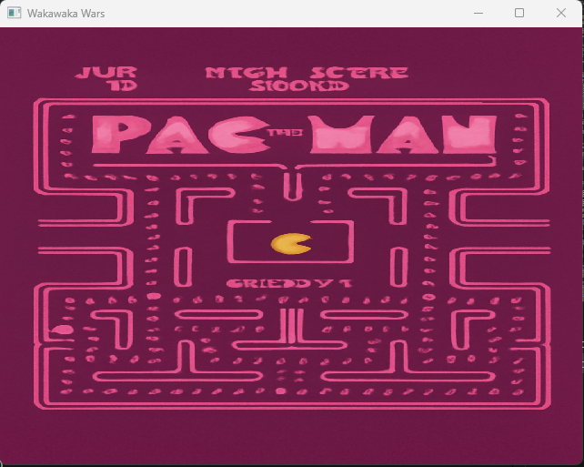
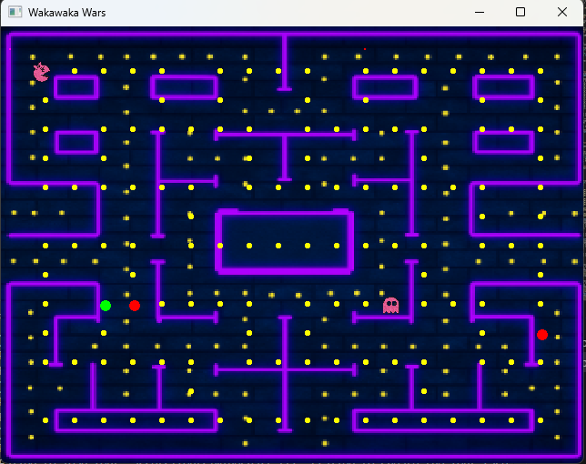

# WakaWaka Wars

## Description
WakaWaka Wars is a two-player game inspired by Pacman. One player controls Pacman, while the other controls the ghost. The goal is to avoid collision or catch Pacman.

## How to Play
- Player 1 (Pacman): Use `W`, `A`, `S`, `D` keys to move.
- Player 2 (Ghost): Use `I`, `J`, `K`, `L` keys to move.
- Press `Q` to quit the game.

## Requirements
- Msys2
- g++ compiler

## Build and Run
1. Install Msys2 and ensure `g++` is available.
2. Run `make` to build the game.
3. Execute `bin/game` to start playing.

## Controls
- Pacman: `W`, `A`, `S`, `D`
- Ghost: `I`, `J`, `K`, `L`

## License
This project is open-source and free to use.

## How to play it

This is the game's home screen.
With a tab of the space bar the game starts!

This is the maze of our fun game, the one who collides with the other wins.

Good Luck!!